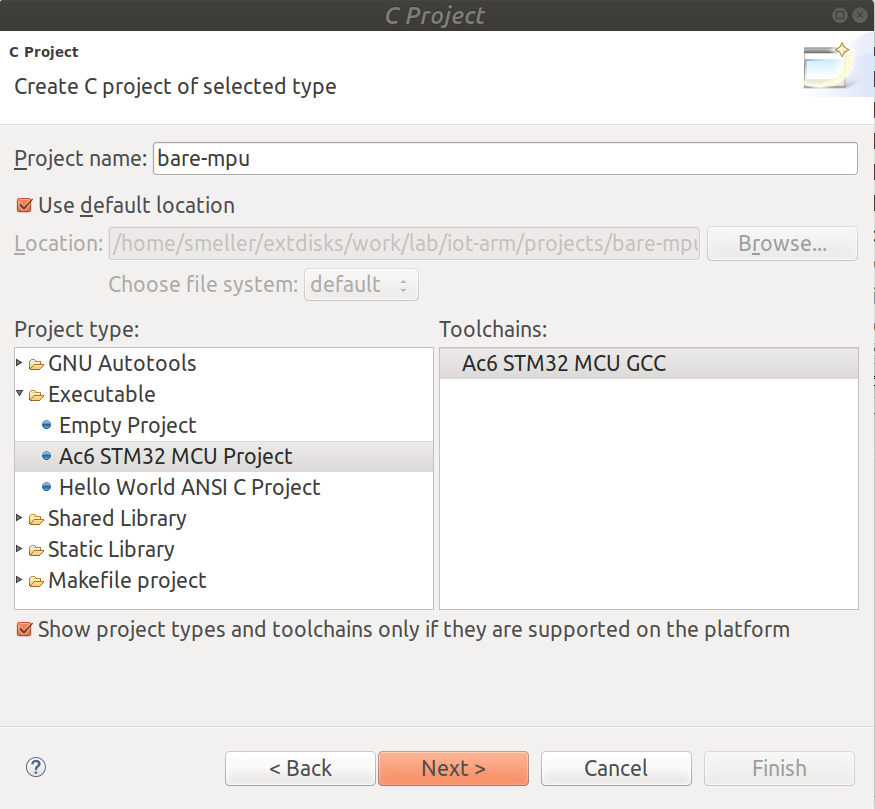
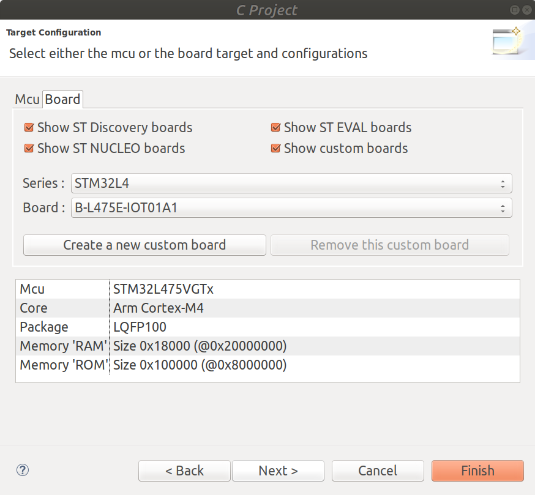
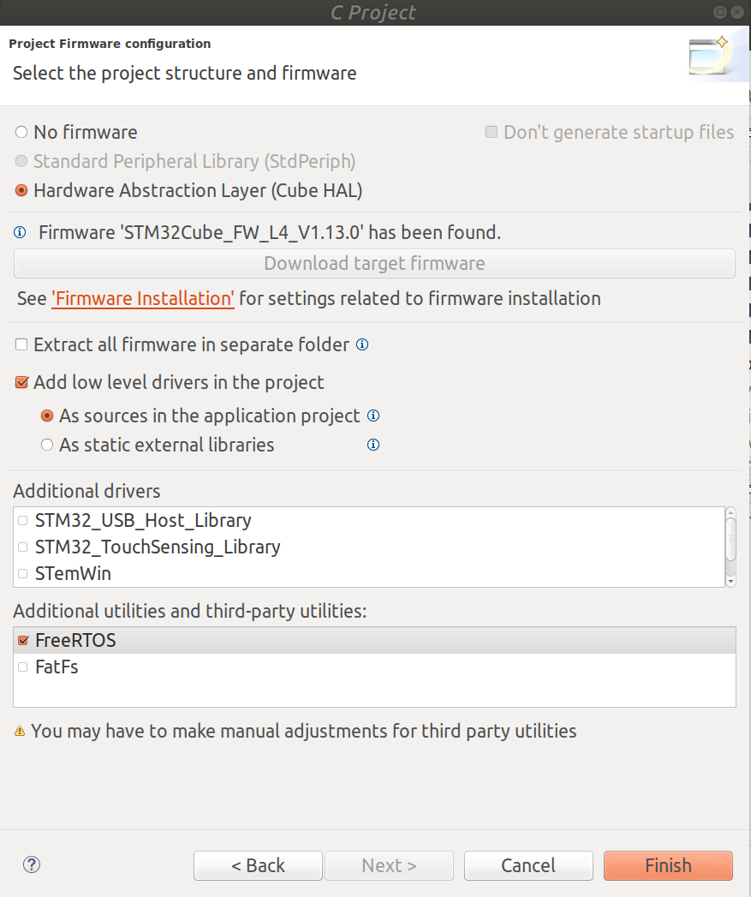

Overview:

[1. MPU Basics](#1-mpu-basics). This section introduce the basic knowlege necessary for hacking MPU on a baremetal & FreeRTOS

[2. MPU on Bare-metal Cortex-M4 Board](#2-mpu-on-bare-metal-cortex-m4-board). A guide for how to setup the MPU bare-metal code running on Cortext-M4 Board (referred board is STM32 Discovery Kit B-L475E-IOT01A2)

[3. Build FreeRTOS with MPU on Cortex-M4 Board](#3-build-freertos-with-mpu-on-cortex-m4-board). A guide to port an existing version of MPU code in FreeRTOS for the Cortext-M4 Board (STM32 Discovery Kit B-L475E-IOT01A2).

# 1. MPU Basics

This introduces what is MPU and how to use it for memory management in FreeRTOS on two architectures: ARMv7-M and ARMv7-R.


## 1.1 What are the options for memory management in ISA level?
Three kinds of memory management solutions contributed by ARMv7-M and ARMv7-R:

1. System address map. 32-bit address space is equally divided into 8 regions, 0.5GB each, including: Code, SRAM, Periperal, 2 RAM regions, 2 Device regions, System region.
2. Protected Memory System Architecture (PMSAv7), based on Memory Protection Unit (MPU). MPU divides address space into regions, and access control information of each region stored in registers.
3. Virtual Memory System Architecture (VMSA), based on Memory Management Unit (MMU). MMU use translation tables to virtualize address space and access control information stored in translation table descriptors (short/long descriptors).

ARMv7-M supports the first two solutioins, ARMv7-R supports the second, and ARMv7-A supports the third.

## 1.2 On ARMv7-M, what kind of access control policy can system address map enforce for a certain region?

System address map defines attributes for each memory region. These attributes are used by the processor to determine the access behaviors. Attributes includes:

- Execute Never region: XN.
- Cache policies: WT (write-through), WBWA(write back, write allocate)

- Shareable region.
- Strongly-ordered memory. 

- implementation defined: R/W, RO, NA.

When MPU disabled, the system use the attributes in this default map for access control. When MPU enabled, the default map could be used as background map for privileged access. A background map means if MPU does not define the permission, or 

## 1.3 How to manage MPU in ISA level?

### 1.3.1 On ARMv7-M:

> Reference: [ARMv7-M manual](manual/DDI0403E_B_armv7m_arm.pdf), Section B3.5.1~3.5.9

In ARMv7-M, software use a pair of registers to define a region of memory, namely

- MPU_RBAR (MPU Region Base Address Register). This is the base address of a region.

- MPU_RASR (MPU Region Attribute and Size Register). This controls the region size, sub-region access, access permissions, memory type, and other properties of the region.

There are 4 pairs of MPU_RBAR/MPU_RASR registers, named *MPU alias registers*, allowing to store and enforce four regions at the same time without swapping contexts. Those three more pairs are named *_A1, *_A2, and *_A3 (replace * with original names above).

Three general MPU registers are used to support the enforcement of MPU:

- MPU_TYPE. Indicates whether MPU is supported in the processor. If so, indicates how many regions are supported.

- MPU_CONTROL. Enables MPU, and control whether the default address map is enabled as a background region for privileged accesses. Also controls whether MPU is enabled for HardFaults, NMIs, and exception handlers when FAULTMASK is set to 1. (FAULTMASK=1 ([B1.4.3](manual/DDI0403E_B_armv7m_arm.pdf)) raise the execution priority to -1)

- MPU_RNR. This is used to select region currently accessed by MPU_RBAR and MPU_RASR. Normally, software must first write the region number to MPU_RNR, and then use MPU_RBAR or MPU_RASR to access the selected region. However, if MPU_RBAR.VALID bit is set, the software can write to MPU_RBAR without first write MPU_RNR.


### 1.3.2 On ARMv7-R

> Reference: [ARMv7-AR manual](manual/armv7ar-manual-0.DDI0406C_d.pdf), Chapter B5.

In ARMv7-R, software use *CP15 registers* to define protection regions in the physical memory map.

For each defined region, CP15 registers specify: 
1. the region size.
2. the base address.
3. the memory attributes, for example, memory type and access permissions. 

Regions >= 256 bytes could be furthuer split into 8 subregions.


> PL0: lowest privilege level, i.e. unprivileged. <br>
> PL1: usually privileged.


## 1.4 How does FreeRTOS support MPU?

### 1.4.1 Footprints in FreeRTOS source (where can we found the MPU code?)

#### Based on [Amazon-freertos-1.4.7](https://github.com/aws/amazon-freertos/tree/v1.4.7) (FreeRTOS 10.1.1)

| code path  | description | examples |
| ---       | ---        | ----   |
| [*/private/mpu_prototypes.h](https://github.com/aws/amazon-freertos/blob/v1.4.7/lib/include/private/mpu_prototypes.h) | MPU functions as the replacements of non-MPU API functions | - `MPU_*()` <br> - `MPU_xTaskCreate(...)` |
| [*/private/mpu_wrappers.h](https://github.com/aws/amazon-freertos/blob/v1.4.7/lib/include/private/mpu_wrappers.h) | Wrappers to map non-MPU functions to equivalent MPU functions. | - `#define xTaskCreate MPU_xTaskCreate` |
| [*/private/portable.h](https://github.com/aws/amazon-freertos/blob/v1.4.7/lib/include/private/portable.h) | Portable Layer API. Each function must be defined for each port. | - `#include "mpu_wrappers.h"` <br> - `if(portUSING_MPU_WRAPPERS == 1) StackType_t *pxPortInitialiseStack(.., + BaseType_t xRunPrivileged )` <br> - `void vPortStoreTaskMPUSettings(...)`
| [lib/include/task.h](https://github.com/aws/amazon-freertos/blob/v1.4.7/lib/include/task.h) | macros, data structs, API for task management | - `struct xMEMORY_REGION`: defines memory ranges allocated to the task when an MPU is used. <br> - `void vTaskAllocateMPURegions(...)` <br> - `BaseType_t xTaskCreate(...)`
| [*/ARM_CM4_MPU/portmacro.h](https://github.com/aws/amazon-freertos/blob/v1.4.7/lib/FreeRTOS/portable/GCC/ARM_CM4_MPU/portmacro.h) | Port specific definitions. <br> contains MPU related data structures. | - `struct xMPU_REGION_REGISTERS` <br> - `struct xMPU_SETTINGS`
| [*/ARM_CM4_MPU/port.c](https://github.com/aws/amazon-freertos/blob/v1.4.7/lib/FreeRTOS/portable/GCC/ARM_CM4_MPU/port.c) | Portable Layer API. Contains: <br> - Hardware initialization, <br> - MPU initialization, etc  | - `#define portMPU_TYPE_REG (*((uint32_t*) 0xe000ed90))` <br> - `prvSetupMPU()` <br> - `vPortStoreTaskMPUSettings()` |

### 1.4.2 MPU initialization
Based on [Amazon-freertos-1.4.7](https://github.com/aws/amazon-freertos/tree/v1.4.7) 
`prvSetupMPU()`

### 1.4.3 Creating a task using MPU
`MPU_xTaskCreate()`


# 2. MPU on Bare-metal Cortex-M4 Board

After learning from the ARM manual and FreeRTOS source code, now let's start hacking on real board. This section and [next section](#3-build-freertos-with-mpu-on-cortex-m4-board) will discuss how to compose MPU code on a bare metal machine as well as how to enable the existing MPU code in FreeRTOS for Cortext-M4 board.

## 2.1 Create a new project with FreeRTOS code from IDE
From Eclipse IDE (System Workbench for STM32) menu, Select 'File' -> 'New' -> 'C Project', in the dialog:

- set the *Project name*
- set *Project type* as 'Executable -> Ac6 STM32 MCU Project'
- leave else as default. An example setup as below:



Then, click 'Next', a dialog named *select configurations*, I only left them as default. 

Click 'Next', we have the *Target configuration* dialog. In *Board* tab, find and select 'STM32L4' in **Series** dropdown menu, and select 'B-L475E-IOT01A1' in **Board** dropdown menu. leave else as default. Example shown below: 



Click 'Next', goes to *Project Firmware configuration* dialog, select **Hardware Abstraction Layer (Cube HAL)** (default is **No firmware**); in the bottom white box, named *Additional utilities and third-party utilities*, select **FreeRTOS**. Leave else as default. An exmple shown as below:



Finally, click 'Finish'. You will get a project with the following folder/file hierachies:

<pre>
- Project name
  |- Includes
  |- HAL_Driver
  |- Middlewares
    |- Third_Party
      |- FreeRTOS      // this is the FreeRTOS code
  |- Utilities
  |- src
     |- main.c          // this has the entry function
     |- stm32l4xx_it.c  // this defines some exception handlers
  |- startup
  |- CMSIS
  |- inc
  |- B-L475E-IOT01A1.xml
  |- LinkerScript.ld      // This is the linker script 
</pre>

## 2.2 Define/Access protected data or code
Data or code needs to be placed at a certain MPU region in order to be protected by MPU. A region of code or data in the source code can be defined by section attribute. In this tutorial, we name our protected section as **shadow_stack**. For example, to declare a protected variable **shadow_stack_data**:

```
char shadow_stack_data[StackSize] __attribute__((section (".shadow_stack"))) __attribute__((__used__)) = "shadow";
```

To Access it using normal load in privileged mode:

```
 // read shadow using normal load
  __asm volatile
     ( "ldr r0, %0\n"
       ::"m"(shadow_stack_data): "r0","memory"
     ); 
  // or just:
 printf("%s\r\n", shadow_stack_data);
```

To access it using unprivileged load in privileged mode:

```C
// reading variable using unprivileged load instruction in privileged mode
// here should get memory fault if MPU marks the accessed memory region as no access for unprivileged mode.
__asm volatile
  ( "ldrt r0, %0\n"
    ::"m"(shadow_stack_data): "r0","memory"
  );
```

To access the data using normal load in unprivileged mode, we need to first drop the CPU privilege to user mode, then access the data:

> **WARNING** after dropping privilege, the only way to get back is via SVC instruction with a proper SVC handler. To set it up, see [2.5 Setup SVC handler [optional]](#25-setup-svc-handler-optional)

```C
// drop privilege. 
__asm volatile ( " mrs r0, control  \n"
      " orr r0, #1   \n"
      " msr control, r0 \n"
      :::"r0", "memory" );

// access protected data, should fault
__asm volatile ( "ldr r0, %0\n"
          ::"m"(shadow_stack_data): "r0","memory" ); 
```

## 2.3 Update linker script to place protected code/data

Previous step defines the code/data section to be protected by MPU. The linker needs to place each section into certain memory regions to generate the final binary. Which section goes to which memory region is determined by commands in the linker script.

For example, the following commands will define a memory region and place the protected data section **shadow_stack** onto that region:

```ld
MEMORY {
  FLASH (rx)     : ORIGIN = 0x8000000,  LENGTH = 1024K
  RAM (xrw)      : ORIGIN = 0x20000000, LENGTH = 96K
  RAM_STACK (xrw)      : ORIGIN = 0x10000000, LENGTH = 32K /* memory to place shadow_stack */
}

SECTIONS {
  .shadow_stack :
  {
    . = ALIGN(0x20);        /* aligned by 32 bytes */
    _shadow_stack_start = .;  /* define a variable as starting address of the region */
    *(.shadow_stack)        /* place the section */
    . = ALIGN(0x20);        /* align the memory */
    _shadow_stack_end = .;  /* define a variable as the ending address of the region */ 
  } >RAM_STACK    /* loading the above section of data into the memory region defined as RAM_STACK*/
}
```

> More info about [Linker Script](https://sourceware.org/binutils/docs/ld/Scripts.html#Scripts) <br>
> [Linker script in STM32](http://developers.stf12.net/cpp-demo/gcc-linker-script-and-stm32-a-tutorial)

## 2.4 Setup memory fault handler
Once MPU enabled, denied memory access will cause a memory fault. By default, all undefined faults goes to a default handler which is an infinite loop. In order to distinguish memory access fault, we define the memory fault handler which is also an infinite loop. Each time we got traped in the loop, we know we have an memory access error. For example, add the following code to `src/stm32l4xx_it.c`:

```C
// file: src/stm32l4xx_it.c

/**
* @brief This function handles Memory management fault.
*/
void MemManage_Handler(void)
{
  while (1)
  {
  }
}

```

No other changes needed since the function name of `MemManage_Handler` already got registered by default in the vector table. Details can be found at `inc/stm32l4xx_it.h` and `startup/startup_stm32l475xx.S`. 

## 2.5 Setup SVC handler [optional]

Supervisor Calls (SVC) are used by application code to request a service from the underlying operating system. Using the SVC instruction, the application can instigate a Supervisor Call for a service requiring privileged access to the system. The is how the unprivileged process **indirectly** using the privileged operations on the system.

Once we drop the CPU privilege into user mode, we can use a specially designed SVC handler to change the privilege back. The following code will allow a user space code to change to privileged via `svc #2` instruction. Number 2 can be replaced by any other unused number by current SVC handlers.
 
First, change `vPortSVCHandler` to
```C
// file: Middlewares/Third_Party/FreeRTOS/Source/portable/GCC/ARM_CM4F/port.c
void vPortSVCHandler( void )
{
 /* Assumes psp was in use. */
 __asm volatile
 (
   " tst lr, #4      \n"
   " ite eq       \n"
   " mrseq r0, msp     \n" /* lele: this branch taken */
   " mrsne r0, psp     \n"
   " b %0       \n"
   ::"i"(prvSVCHandler):"r0", "memory"
 );
}
```

Then, add the definition of `prvSVCHandler`:

```C
// file: Middlewares/Third_Party/FreeRTOS/Source/portable/GCC/ARM_CM4F/port.c

static void prvSVCHandler( uint32_t *pulParam) {
uint8_t ucSVCNumber;

/* The stack contains: r0, r1, r2, r3, r12, r14, the return address and
xPSR.  The first argument (r0) is pulParam[ 0 ]. */

ucSVCNumber =  ( ( uint8_t * ) pulParam[ 6 ] )[ -2 ];
switch( ucSVCNumber )
{
  case 2 : 
    __asm volatile
    (
      " mrs r1, control  \n" /* Obtain current control value. */
      " bic r1, #1   \n" /* Set privilege bit. */
      " msr control, r1  \n" /* Write back new control value. */
      ::: "r1", "memory"
    );
    break;
  default: /* Unknown SVC call. */
    break;
  }
}

```

Now, we can define the function of `raisePrivilege()` as:

```C

int raisePrivilege(){
 __asm volatile
 (
  " svcne %0       \n" /* Switch to privileged. */
  " bx lr        \n"
  :: "i" (2) : "r0", "memory"
 );
 return 0; // never reached.
}
```

In user space, calling `raisePrivilege()` will switch CPU mode to privileged and the process will become a `kernel thread` when returned from this function. (This is just a hack for testing without any security policy obeyed.)

## 2.6 Initialize MPU

From [1.3.1 MPU On ARMv7-M](#131-on-armv7-m), we know each MPU region is configured by a set of registers. Here is an example code to do it:

```C
#define portPRIVILEGED_RAM_REGION   ( 3UL )
#define portNVIC_SYS_CTRL_STATE_REG    ( * ( ( volatile uint32_t * ) 0xe000ed24 ) )
#define portNVIC_MEM_FAULT_ENABLE    ( 1UL << 16UL )
/* Constants required to access and manipulate the MPU. */
#define portMPU_CTRL_REG      ( * ( ( volatile uint32_t * ) 0xe000ed94 ) )
#define portMPU_REGION_NUMBER_REG       ( * ( ( volatile uint32_t * ) 0xe000ed98 ) )
#define portMPU_REGION_BASE_ADDRESS_REG   ( * ( ( volatile uint32_t * ) 0xe000ed9C ) )
#define portMPU_REGION_ATTRIBUTE_REG   ( * ( ( volatile uint32_t * ) 0xe000edA0 ) )
#define portMPU_REGION_VALID     ( 0x10UL )
#define portMPU_REGION_ENABLE     ( 0x01UL )


#define portMPU_REGION_PRIVILEGED_READ_WRITE ( 0x01UL << 24UL )

void init_mpu_shadow_stack(void){

 extern uint32_t _shadow_stack_start[];
 extern uint32_t _shadow_stack_end[];

  /* setup shadow stack with privilege access only. */
  portMPU_REGION_BASE_ADDRESS_REG = ( ( uint32_t ) _shadow_stack_start ) | /* Base address. */
      ( portMPU_REGION_VALID ) |
      ( portPRIVILEGED_RAM_REGION );

  portMPU_REGION_ATTRIBUTE_REG = ( portMPU_REGION_PRIVILEGED_READ_WRITE ) |
      ( portMPU_REGION_CACHEABLE_BUFFERABLE ) |
      (prvGetMPURegionSizeSetting( ( uint32_t ) _shadow_stack_end - ( uint32_t ) _shadow_stack_start ) ) |
      ( portMPU_REGION_ENABLE );

  /* Enable the memory fault exception. */
  portNVIC_SYS_CTRL_STATE_REG |= portNVIC_MEM_FAULT_ENABLE;

  /* Enable the MPU with the background region configured. */
  portMPU_CTRL_REG |= ( portMPU_ENABLE | portMPU_BACKGROUND_ENABLE );

}
```

## 2.7 Test run

Full source code is available at [bare-metal-mpu](code/bare-mpu.tar.xz). Import it using IDE, and test run it. What it does is:

- initialize debugging port.
- initialize MPU.
- read data using regular load instruction in protected region (section **shadow_stack**)
- read data using unprivileged load in protected region (should fail & trap in MemManage_Handler)
- drop privilege
- read data in protected region (should fail & trap in MemManage_Handler)
- raise privilege
- read data again in protected region.


# 3. Build FreeRTOS with MPU on Cortex-M4 Board

> Reference [offical FreeRTOS manual](https://www.freertos.org/FreeRTOS-MPU-memory-protection-unit.html)

This is based on Amazon FreeRTOS (tested on [current release version 1.4.7](https://github.com/aws/amazon-freertos/tree/v1.4.7), and an [older version of 1.1.0](https://github.com/aws/amazon-freertos/tree/v1.1.0)). 

## 2.1 Download the project source code

## 2.2 Create a project and import existing code

## 2.3 Change port from ARM_CM4F to ARM_CM4_MPU

## 2.4 Add mpu_wrappers.c into source tree

## 2.5 Update FreeRTOS configuration file

## 2.6 Update linker scripts for MPU regions

## 2.7 Test run

# 4. Adapting/Optimizing MPU for Silhouette

